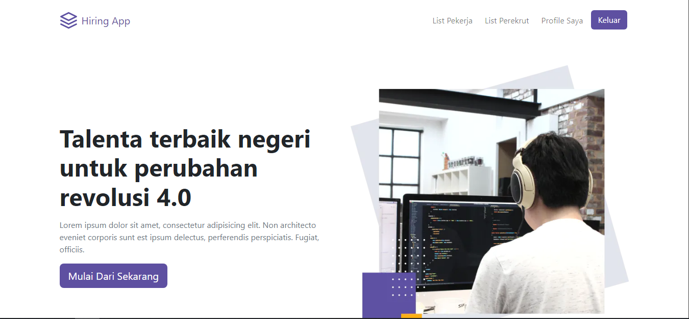
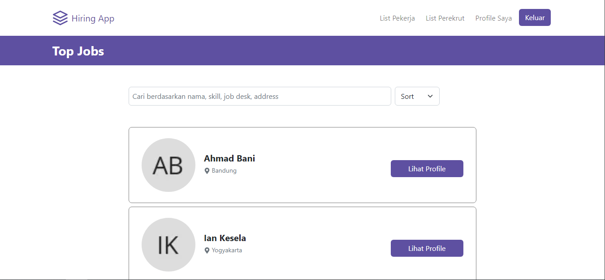
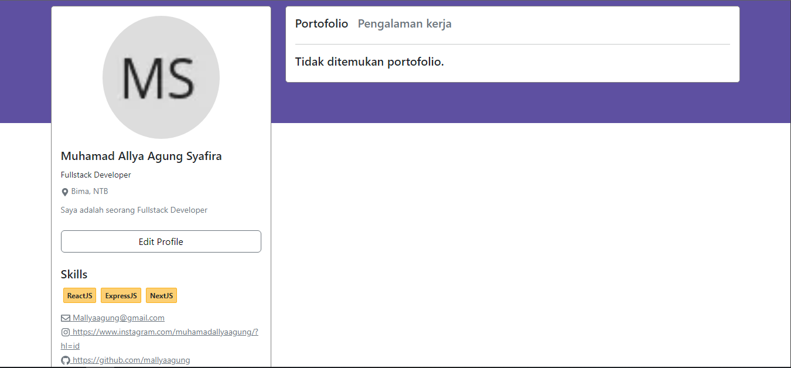

# Hiring App

Hiring App is an web application where you can find a job that suit your skill. This app is develop using Next.JS. You can make account as a worker or a recruiter and put your project on the website.

## Usage

First you need to clone the repositories.

```bash
git clone https://github.com/mallyaagung/hiring-app-fe.git
```
After that run this command to install all the package needed.
```bash
npm install
```
Then, to run the app use this command
```bash
npm run start
```

## Demo
To use this app use this link

[Demo](https://hiring-app-fe.vercel.app/)

## Screenshot





